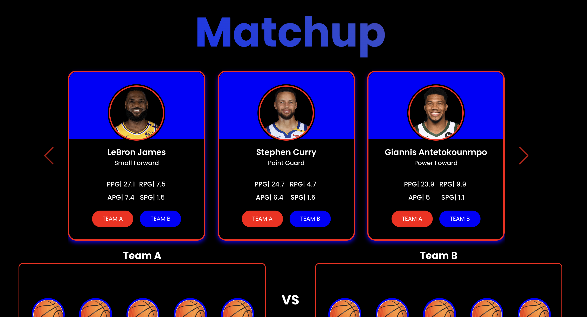
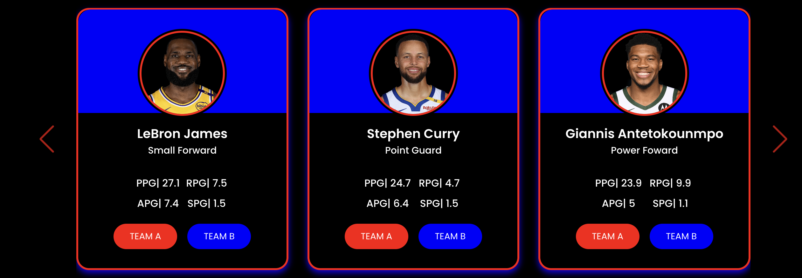
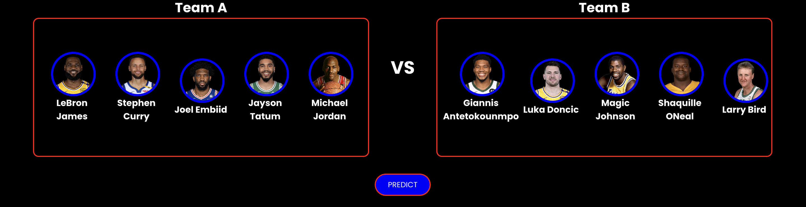
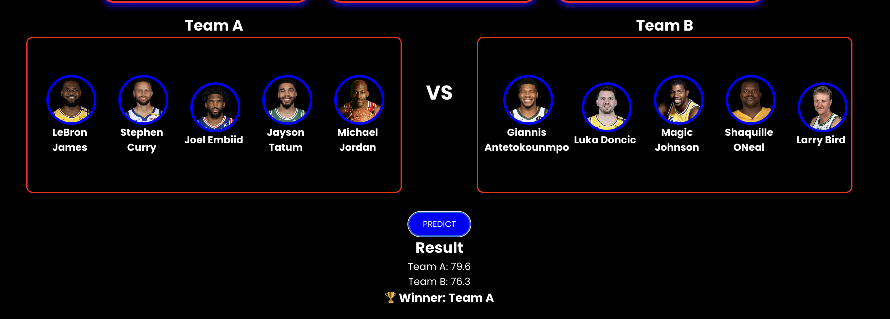
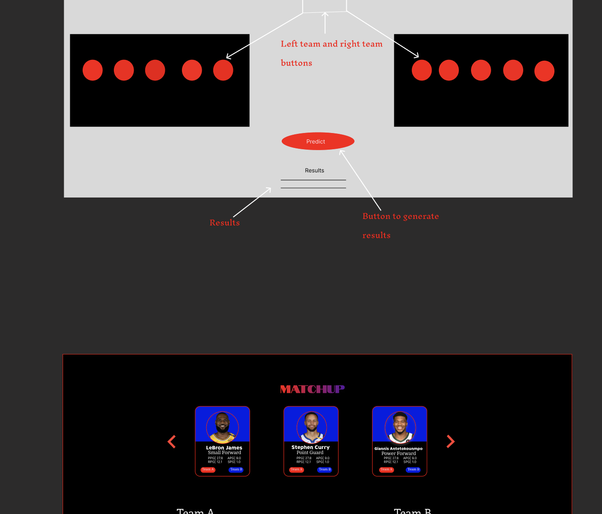

# NBA Matchup Predictor
Matchup is a front-end web application created with the goal of helping basketball enthusiast. This front-end client is built with [React](https://react.dev/) functional components, styled with vanilla CSS.

## Description

Matchup was developed for basketball enthusiast who ever had a debate about which team would beat which team or how legend teams would hold up against current teams.  

Once on site account, the player list is available to be viewed via carousel. User can click either the right or left arrow to scroll through players.

Users can select 10 players, 5 for Team A and 5 for Team B. Once players are selected, user can click button
to have the computer calculate and determined which team would win based on players selected stats.

>Future Feature: I will allow users to select 12 players for each team to reflect the amount of players on
an NBA team

>Future Feature: I will fetch the players from an API so that every NBA player is listed

## Running the App Locally

1. Clone the repository to your local machine: 
    `git clone https://github.com/DQuaya/nba-team-matchup`

2. Navigate to the cloned repository: 
    `cd the-brew-buddy`

3. Install the dependencies: 
    `npm install`

4. Start the application: 
    `npm run preview`

The application will start on http://localhost:3001.

## Deployed Application
You can access the deployed application at: https://nba-team-matchup.onrender.com

## Application Flow and Wireframes

The application has the following one screen:

- Landing: Shows the players and teams.

- Player List: Shows a list of all listed NBA Players hardcoded for now, as well as a button to add players to each team. 

- Team: Shows a user's selected players and with the teams assigned to those players. 

- Results: Shows user the calculate results of the teams selected stats as well as the winner between those two teams.
### Figma:

Using Figma, I created and design the appearance of this application. 

### Development Team
DonQuaya Brown - [LinkedIn](https://www.linkedin.com/in/donquayabrown/) | [GitHub](https://github.com/DQuaya)

